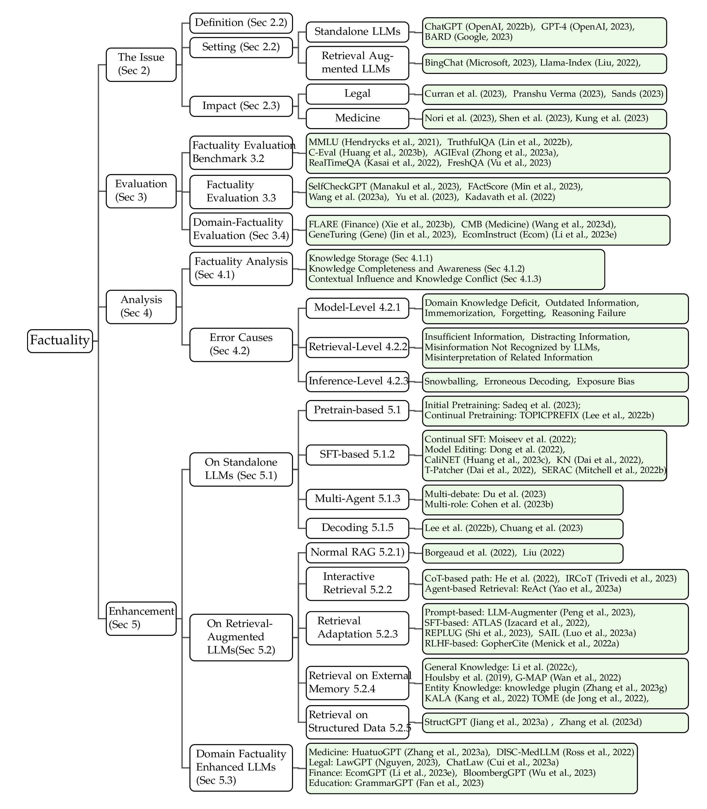

# LLM-Factuality-Survey
The repository for the survey paper "**Survey on Factuality in Large Language Models: Knowledge, Retrieval and Domain-Specificity**"

[[Tables](https://github.com/wangcunxiang/LLM-Factuality-Survey#tables)]
[[Paper list](https://github.com/wangcunxiang/LLM-Factuality-Survey#paper-list)]

# Paper List

## Analysis of Factuality

### Knowledge Storage
1. Language Models as Knowledge Bases?. _Petroni et al._ 2019. [[Paper](https://doi.org/10.18653/v1/D19-1250)]
1. Locating and Editing Factual Associations in GPT. _Meng et al._ 2022. [[Paper](https://openreview.net/forum?id=-h6WAS6eE4)]
1. Transformer Feed-Forward Layers Are Key-Value Memories. _Geva et al._ 2021. [[Paper](https://doi.org/10.18653/v1/2021.emnlp-main.446)]
1. Transformer Feed-Forward Layers Build Predictions by Promoting Concepts in the Vocabulary Space. _Geva et al._ 2022. [[Paper](https://aclanthology.org/2022.emnlp-main.3)]
1. Dissecting Recall of Factual Associations in Auto-Regressive Language
Models. _Globerson et al._ 2023. [[Paper](https://arxiv.org/abs/2304.14767)]
1. Journey to the Center of the Knowledge Neurons: Discoveries of Language-Independent Knowledge Neurons and Degenerate Knowledge Neurons. _Chen et al._ 2023. [[Paper](https://arxiv.org/abs/2308.13198)]
1. A rigorous study of integrated gradients method and extensions to internal neuron attributions. _Lundstrom et al._ 2022. [[Paper](https://arxiv.org/abs/2202.11912)]

### Knowledge Awareness

1.  CRITIC: Large Language Models Can Self-Correct with Tool-Interactive Critiquing. _Gou et al._ 2023. [[Paper](https://arxiv.org/abs/2305.11738)]
1.  Investigating the Factual Knowledge Boundary of Large Language Models with Retrieval Augmentation. _Ren et al._ 2023. [[Paper](https://arxiv.org/abs/2307.11019)]
1.  Do Large Language Models Know What They Don't Know?. _Yin et al._ 2023. [[Paper](https://doi.org/10.18653/v1/2023.findings-acl.551)]
1.  A Survey on In-context Learning. _Dong et al._ 2023. [[Paper](https://arxiv.org/abs/2301.00234)]
1.  Language Models (Mostly) Know What They Know. _Kadavath et al._ 2022. [[Paper](https://arxiv.org/abs/2207.05221)]
1.   The internal state of an llm knows when its lying. _Azaria et al._ 2023. [[Paper](https://arxiv.org/abs/2304.13734)]

### Parametric Knowledge vs Retrieved Knowledge

1.  Generate rather than retrieve: Large language models are strong context generators. _Yu et al._ 2023. [[Paper](https://arxiv.org/abs/2209.10063)]
1.  Leveraging Passage Retrieval with Generative Models for Open Domain Question Answering. _Izacard et al._ 2021. [[Paper](https://doi.org/10.18653/v1/2021.eacl-main.74)]
1.  Large language models struggle to learn long-tail knowledge. _Kandpal et al._ 2023. [[Paper](https://arxiv.org/abs/2211.08411)]
1.  Head-to-Tail: How Knowledgeable are Large Language Models (LLM)? AKA Will LLMs Replace Knowledge Graphs?. _Sun et al._ 2023. [[Paper](https://arxiv.org/abs/2308.10168)] 

### Contextual Influence
1. Large Language Models with Controllable Working Memory. _Li et al._ 2023. [[Paper](https://doi.org/10.18653/v1/2023.findings-acl.112)]
1.  Context-faithful Prompting for Large Language Models. _Zhou et al._ 2023. [[Paper](https://arxiv.org/abs/2303.11315)]
1.  Benchmarking Large Language Models in Retrieval-Augmented Generation. _Chen et al._ 2023. [[Paper](https://arxiv.org/abs/2309.01431)]
1.  Automatic Evaluation of Attribution by Large Language Models. _Yue et al._ 2023. [[Paper](https://arxiv.org/abs/2305.06311)]

###  Knowledge Conflicts
1. Entity-Based Knowledge Conflicts in Question Answering. _Longpre et al._ 2021. [[Paper](https://arxiv.org/abs/2109.05052)]
1. Rich Knowledge Sources Bring Complex Knowledge Conflicts: Recalibrating Models to Reflect Conflicting Evidence. _Chen et al._ 2022. [[Paper](https://arxiv.org/abs/2210.13701)]
1. Adaptive Chameleon or Stubborn Sloth: Unraveling the Behavior of Large Language Models in Knowledge Clashes. _Xie et al._ 2023. [[Paper](https://arxiv.org/abs/2305.13300)]
1. Large Language Models with Controllable Working Memory. _Li et al._ 2023. [[Paper](https://doi.org/10.18653/v1/2023.findings-acl.112)]

## Causes of Factual Errors

### Model-level Causes

#### Forgetting

1. An Empirical Investigation of Catastrophic Forgetting in Gradient-Based Neural Networks. _Goodfellow et al._ 2015. [[Paper](https://arxiv.org/abs/1312.6211)]
1. Preserving In-Context Learning ability in Large Language Model Fine-tuning. _Wang et al._ 2022. [[Paper](https://arxiv.org/abs/2211.00635)]
1. Recall and Learn: Fine-tuning Deep Pretrained Language Models with Less Forgetting. _Chen et al._ 2020. [[Paper](https://arxiv.org/abs/2004.12651)]
1. Investigating the Catastrophic Forgetting in Multimodal Large Language Models. _Zhai et al._ 2023. [[Paper](https://arxiv.org/abs/2309.10313)]
1. An Empirical Study of Catastrophic Forgetting in Large Language Models During Continual Fine-tuning. _Luo et al._ 2023. [[Paper](https://arxiv.org/abs/2308.08747)]

#### Reasoning Failure
1. We're Afraid Language Models Aren't Modeling Ambiguity. _Liu et al._ 2023. [[Paper](https://arxiv.org/abs/2304.14399)]
1. The Reversal Curse: LLMs trained on "A is B" fail to learn "B is A". _Berglund et al._ 2023. [[Paper](https://arxiv.org/abs/2309.12288)]
1. Understanding Catastrophic Forgetting in Language Models via Implicit Inference. _Kotha et al._ 2023. [[Paper](https://arxiv.org/abs/2309.10105)]
1. Can ChatGPT Replace Traditional KBQA Models? An In-depth Analysis of the Question Answering Performance of the GPT LLM Family. _Tan et al._ 2023. [[Paper](https://arxiv.org/abs/2303.07992)]

### Retrieval-level Causes

#### Misinformation Not Recognized by LLMs
1. Entity-Based Knowledge Conflicts in Question Answering. _Longpre et al._ 2021. [[Paper](https://arxiv.org/abs/2109.05052)]
1. On the Risk of Misinformation Pollution with Large Language Models. _Pan et al._ 2023. [[Paper](https://arxiv.org/abs/2305.13661)]
1. A Survey on Truth Discovery. _Han et al._ 2015. [[Paper](https://doi.org/10.1145/2897350.2897352)]

#### Distracting Information

1. SAIL: Search-Augmented Instruction Learning. _Luo et al._ 2023. [[Paper](https://arxiv.org/abs/2305.15225)]
1. Lost in the middle: How language models use long contexts. _Liu et al._ 2023. [[Paper](https://arxiv.org/abs/2307.03172)]

#### Misinterpretation of Related Information
1. ReAct: Synergizing Reasoning and Acting in Language Models. _Yao et al._ 2023. [[Paper](https://arxiv.org/abs/2210.03629)]

### Inference-level Causes

#### Snowballing
1. How language model hallucinations can snowball. _Zhang et al._ 2023. [[Paper](https://arxiv.org/abs/2305.13534)]
1. A Stitch in Time Saves Nine: Detecting and Mitigating Hallucinations of LLMs by Validating Low-Confidence Generation. _Varshney et al._ 2023. [[Paper](https://arxiv.org/abs/2307.03987)]

#### Erroneous Decoding
1. DoLa: Decoding by Contrasting Layers Improves Factuality in Large Language Models. _Chuang et al._ 2023. [[Paper](https://arxiv.org/abs/2309.03883)]
1. How Decoding Strategies Affect the Verifiability of Generated Text. _Massarelli et al._ 2020. [[Paper](https://arxiv.org/abs/1911.03587)]

#### Exposure Bias

1. WinoQueer: A Community-in-the-Loop Benchmark for Anti-LGBTQ+ Bias in Large Language Models. _Felkner et al._ 2023. [[Paper](https://aclanthology.org/2023.acl-long.507/)]
1. Bias and Fairness in Large Language Models: A Survey. _Gallegos et al._ 2023. [[Paper](https://arxiv.org/abs/2309.00770)]
1. MISGENDERED: Limits of Large Language Models in Understanding Pronouns. _Hossain et al._ 2023. [[Paper](https://doi.org/10.18653/v1/2023.acl-long.293)]

## Evaluation of Factuality

### Benchmarks

1. Measuring Massive Multitask Language Understanding. _Hendrycks et al._ 2021. [[Paper](https://arxiv.org/abs/2009.03300)]
1. TruthfulQA: Measuring How Models Mimic Human Falsehoods. _Lin et al._ 2022. [[Paper](https://doi.org/10.18653/v1/2022.acl-long.229)]
1.  HaluEval: A Large-Scale Hallucination Evaluation Benchmark for Large Language Models. _Li et al._ 2023. [[Paper](https://arxiv.org/abs/2305.11747)]
1.  C-Eval: A Multi-Level Multi-Discipline Chinese Evaluation Suite for Foundation Models. _Huang et al._ 2023. [[Paper](https://arxiv.org/abs/2305.08322)]
1. Do Large Language Models Know What They Don't Know?. _Yin et al._ 2023. [[Paper](https://doi.org/10.18653/v1/2023.findings-acl.551)]
1. Do Large Language Models Know about Facts?. _Hu et al._ 2023. [[Paper](https://arxiv.org/abs/2310.05177)]
1. RealTime QA: What's the Answer Right Now?. _Kasai et al._ 2022. [[Paper](https://arxiv.org/abs/2207.13332)]
1. FreshLLMs: Refreshing Large Language Models with Search Engine Augmentation. _Vu et al._ 2023. [[Paper](https://arxiv.org/abs/2310.03214)]
1. Beyond the Imitation Game: Quantifying and extrapolating the capabilities of language models. _Srivastava et al._ 2023. [[Paper](https://openreview.net/forum?id=uyTL5Bvosj)]
1. Natural Questions: a Benchmark for Question Answering Research. _Kwiatkowski et al._ 2019. [[Paper](https://aclanthology.org/Q19-1026)]
1. TriviaQA: A Large Scale Distantly Supervised Challenge Dataset for Reading Comprehension. _Joshi et al._ 2017. [[Paper](https://aclanthology.org/P17-1147)]
1. Semantic Parsing on Freebase from Question-Answer Pairs. _Berant et al._ 2013. [[Paper](https://aclanthology.org/D13-1160)]
1. Open Question Answering over Tables and Text. _Chen et al._ 2021. [[Paper](https://arxiv.org/abs/2010.10439)]
1. AmbigQA: Answering Ambiguous Open-domain Questions. _Min et al._ 2020. [[Paper](https://doi.org/10.18653/v1/2020.emnlp-main.466)]
1. HotpotQA: A Dataset for Diverse, Explainable Multi-hop Question Answering. _Yang et al._ 2018. [[Paper](https://arxiv.org/abs/1809.09600)]
1. Constructing A Multi-hop QA Dataset for Comprehensive Evaluation of Reasoning Steps. _Ho et al._ 2020. [[Paper](https://doi.org/10.18653/v1/2020.coling-main.580)]
1. IIRC: A Dataset of Incomplete Information Reading Comprehension Questions. _Ferguson et al._ 2020. [[Paper](https://doi.org/10.18653/v1/2020.emnlp-main.86)]
1. MuSiQue: Multihop Questions via Single-hop Question Composition. _Trivedi et al._ 2022. [[Paper](https://doi.org/10.1162/tacl_a_00475)]
1. ELI5: Long Form Question Answering. _Fan et al._ 2019. [[Paper](https://doi.org/10.18653/v1/P19-1346)]
1. FEVER: a large-scale dataset for Fact Extraction and VERification. _Thorne et al._ 2018. [[Paper](https://arxiv.org/abs/1803.05355)]
1. Fool Me Twice: Entailment from Wikipedia Gamification. _Eisenschlos et al._ 2021. [[Paper](https://doi.org/10.18653/v1/2021.naacl-main.32)]
1. HoVer: A Dataset for Many-Hop Fact Extraction And Claim Verification. _Jiang et al._ 2020. [[Paper](https://doi.org/10.18653/v1/2020.findings-emnlp.309)]
1. The Fact Extraction and VERification Over Unstructured and Structured information (FEVEROUS) Shared Task. _Aly et al._ 2021. [[Paper](https://doi.org/10.18653/v1/2021.fever-1.1)]
1. T-REx: A Large Scale Alignment of Natural Language with Knowledge Base Triples. _Elsahar et al._ 2018. [[Paper](https://aclanthology.org/L18-1544)]
1. Zero-Shot Relation Extraction via Reading Comprehension. _Levy et al._ 2017. [[Paper](https://doi.org/10.18653/v1/K17-1034)]
1. Language Models as Knowledge Bases?. _Petroni et al._ 2019. [[Paper](https://doi.org/10.18653/v1/D19-1250)]
1. Neural Text Generation from Structured Data with Application to the Biography Domain. _Lebret et al._ 2016. [[Paper](https://doi.org/10.18653/v1/D16-1128)]
1. WikiAsp: A Dataset for Multi-domain Aspect-based Summarization. _Hayashi et al._ 2021. [[Paper](https://doi.org/10.1162/tacl_a_00362)]
1. KILT: a Benchmark for Knowledge Intensive Language Tasks. _Petroni et al._ 2021. [[Paper](https://doi.org/10.18653/v1/2021.naacl-main.200)]
1. Scaling Language Models: Methods, Analysis \& Insights from Training Gopher. _Rae et al._ 2022. [[Paper](https://arxiv.org/abs/2112.11446)]
1. Curation Corpus Base. _Curation et al._ 2020. [[Paper](https://github.com/CurationCorp/curation-corpus)]
1.  Pointer sentinel mixture models. _Merity et al._ 2016. [[Paper](https://arxiv.org/abs/1609.07843)]
1.  The LAMBADA dataset: Word prediction requiring a broad discourse context. _Paperno et al._ 2016. [[Paper](https://doi.org/10.18653/v1/P16-1144)]
1.  Exploring the Limits of Transfer Learning with a Unified Text-to-Text Transformer. _Raffel et al._ 2020. [[Paper](http://jmlr.org/papers/v21/20-074.html)]
1.   The Pile: An 800GB Dataset of Diverse Text for Language Modeling. _Gao et al._ 2020. [[Paper](https://arxiv.org/abs/2101.00027)]
1.   Wizard of Wikipedia: Knowledge-Powered Conversational agents. _Dinan et al._ 2019. [[Paper](https://arxiv.org/abs/1811.01241)]
1. Grounded response generation task at dstc7. _Galley et al._ 2019. [[Paper](http://workshop.colips.org/dstc7/papers/DSTC7_Task_2_overview_paper.pdf)]
1.   "What do others think?": Task-Oriented Conversational Modeling with Subjective Knowledge. _Zhao et al._ 2023. [[Paper](https://arxiv.org/abs/2305.12091)]
1.   RealToxicityPrompts: Evaluating Neural Toxic Degeneration in Language Models. _Gehman et al._ 2020. [[Paper](https://doi.org/10.18653/v1/2020.findings-emnlp.301)]
1.   Hey AI, Can You Solve Complex Tasks by Talking to Agents?. _Khot et al._ 2022. [[Paper](https://arxiv.org/abs/2110.08542)]
1.   Did Aristotle Use a Laptop? A Question Answering Benchmark with Implicit Reasoning Strategies. _Geva et al._ 2021. [[Paper](https://doi.org/10.1162/tacl_a_00370)]
1.   TempQuestions: A Benchmark for Temporal Question Answering. _Jia et al._ 2018. [[Paper](https://doi.org/10.1145/3184558.3191536)]
1.   INFOTABS: Inference on Tables as Semi-structured Data. _Gupta et al._ 2020. [[Paper](https://doi.org/10.18653/v1/2020.acl-main.210)]

### Studies
1. SelfCheckGPT: Zero-Resource Black-Box Hallucination Detection for Generative Large Language Models. _Manakul et al._ 2023. [[Paper](https://arxiv.org/abs/2303.08896)]
1. Evaluating Open Question Answering Evaluation. _Wang et al._ 2023. [[Paper](https://arxiv.org/abs/2305.12421)]
1. Measuring and Modifying Factual Knowledge in Large Language Models. _Pezeshkpour et al._ 2023. [[Paper](https://arxiv.org/abs/2306.06264)]
1. A Stitch in Time Saves Nine: Detecting and Mitigating Hallucinations of LLMs by Validating Low-Confidence Generation. _Varshney et al._ 2023. [[Paper](https://arxiv.org/abs/2307.03987)]
1. FacTool: Factuality Detection in Generative AI -- A Tool Augmented Framework for Multi-Task and Multi-Domain Scenarios. _Chern et al._ 2023. [[Paper](https://arxiv.org/abs/2307.13528)]
1. Language Models (Mostly) Know What They Know. _Kadavath et al._ 2022. [[Paper](https://arxiv.org/abs/2207.05221)]
1. Generate rather than retrieve: Large language models are strong context generators. _Yu et al._ 2023. [[Paper](https://arxiv.org/abs/2209.10063)]
1. Teaching language models to support answers with verified quotes. _Menick et al._ 2022. [[Paper](https://arxiv.org/abs/2203.11147)]

### Evaluating Domain-specific Factuality

1. PIXIU: A Large Language Model, Instruction Data and Evaluation Benchmark for Finance. _Xie et al._ 2023. [[Paper](https://arxiv.org/abs/2306.05443)]
1. When flue meets flang: Benchmarks and large pre-trained language model for financial domain. _Shah et al._ 2022. [[Paper](https://arxiv.org/abs/2211.00083)]
1. EcomGPT: Instruction-tuning Large Language Model with Chain-of-Task Tasks for E-commerce. _Li et al._ 2023. [[Paper](https://arxiv.org/abs/2308.06966)]
1. CMB: A Comprehensive Medical Benchmark in Chinese. _Wang et al._ 2023. [[Paper](https://arxiv.org/abs/2308.08833)]
1. Genegpt: Augmenting large language models with domain tools for improved access to biomedical information. _Jin et al._ 2023. [[Paper](https://arxiv.org/abs/2304.09667)]
1. Legalbench: A collaboratively built benchmark for measuring legal reasoning in large language models. _Guha et al._ 2023. [[Paper](https://arxiv.org/abs/2308.11462)]
1. LawBench: Benchmarking Legal Knowledge of Large Language Models. _Fei et al._ 2023. [[Paper](https://arxiv.org/abs/2309.16289)]

## Factuality Enhancement

### On Standalone LLM Generation

#### Pretraining-based

##### Initial Pretraining

1. A Multitask, Multilingual, Multimodal Evaluation of ChatGPT on Reasoning, Hallucination, and Interactivity. _Yejin Bang et al._ arXiv 2023. [[Paper](https://arxiv.org/abs/2302.04023)]
1. Deduplicating Training Data Makes Language Models Better. _Lee, Katherine et al._ ACL 2022. [[Paper](https://aclanthology.org/2022.acl-long.577)]
1. Unsupervised Improvement of Factual Knowledge in Language Models. _Sadeq, Nafis et al._ EACL 2023. [[Paper](https://aclanthology.org/2023.eacl-main.215.pdf)]

##### Continual Pretraining

1.   Factuality Enhanced Language Models for Open-Ended Text Generation. _Lee, Nayeon et al._ NeurIPS 2022. [[Paper](https://proceedings.neurips.cc/paper_files/paper/2022/file/df438caa36714f69277daa92d608dd63-Paper-Conference.pdf)]

#### Supervised Finetuning

##### Continual SFT

1.   SKILL: Structured Knowledge Infusion for Large Language Models. _Moiseev, Fedor et al._ NAACL 2022. [[Paper](https://aclanthology.org/2022.naacl-main.113)]
1.   Contrastive Learning Reduces Hallucination in Conversations. _Sun, Weiwei et al._ AAAI 2023. [[Paper](https://arxiv.org/pdf/2212.10400.pdf)]
1.   ChatGPT is not Enough: Enhancing Large Language Models with Knowledge Graphs for Fact-aware Language Modeling. _Linyao Yang et al._ arXiv 2023. [[Paper](https://arxiv.org/pdf/2306.11489.pdf)]

##### Model Editing

1.   Editing Large Language Models: Problems, Methods, and Opportunities. _Yunzhi Yao et al._ arXiv 2023. [[Paper](https://arxiv.org/pdf/2305.13172.pdf)]
1.   Knowledge Neurons in Pretrained Transformers. _Dai, Damai et al._ ACL 2022. [[Paper](https://aclanthology.org/2022.acl-long.581.pdf)]
1.   Locating and Editing Factual Associations in GPT. _Kevin Meng et al._ NeurIPS 2022. [[Paper](https://openreview.net/forum?id=-h6WAS6eE4)]
1.   Editing Factual Knowledge in Language Models. _De Cao, Nicola et al._ EMNLP 2021. [[Paper](https://aclanthology.org/2021.emnlp-main.522.pdf)]
1.   Fast Model Editing at Scale. _Eric Mitchell et al._ ICLR 2022. [[Paper](https://openreview.net/forum?id=0DcZxeWfOPt)]
1.   Inference-Time Intervention: Eliciting Truthful Answers from a Language Model. _Kenneth Li et al._ arXiv 2023. [[Paper](https://arxiv.org/pdf/2306.03341.pdf)]

#### Multi-Agent

1.   Improving Factuality and Reasoning in Language Models through Multiagent Debate. _Yilun Du et al._ arXiv 2023. [[Paper](https://arxiv.org/pdf/2305.14325.pdf)]
1.   LM vs LM: Detecting Factual Errors via Cross Examination. _Roi Cohen et al._ arXiv 2023. [[Paper](https://arxiv.org/pdf/2305.13281.pdf)]

#### Novel Prompt

1.   Generate Rather than Retrieve: Large Language Models are Strong Context Generators. _Yu, Wenhao et al._  ICLR 2023. [[Paper](https://arxiv.org/pdf/2209.10063.pdf)]
1.   "According to ..." Prompting Language Models Improves Quoting from Pre-Training Data. _Orion Weller et al._ arXiv 2023. [[Paper](https://arxiv.org/pdf/2305.13252.pdf)]
1.   Decomposed Prompting: A Modular Approach for Solving Complex Tasks. _Tushar Khot et al._ arXiv 2023. [[Paper](https://arxiv.org/pdf/2210.02406.pdf)]
1.   Chain-of-Verification Reduces Hallucination in Large Language Models. _Dhuliawala et al._ arXiv 2023. [[Paper](https://arxiv.org/pdf/2309.11495.pdf)]

#### Decoding

1.   Factuality Enhanced Language Models for Open-Ended Text Generation. _Lee, Nayeon et al._ NeurIPS 2022. [[Paper](https://proceedings.neurips.cc/paper_files/paper/2022/file/df438caa36714f69277daa92d608dd63-Paper-Conference.pdf)]
1.   DoLa: Decoding by Contrasting Layers Improves Factuality in Large Language Models. _Chuang, Yung-Sung et al._ arXiv 2023. [[Paper](https://arxiv.org/pdf/2309.03883.pdf)]

 ### On Retrieval-Augmented Generation

#### Normal RAG Setting

1.   Improving Language Models by Retrieving From Trillions of Tokens. _Sebastian Borgeaud et al._ arXiv 2021. [[Paper](https://arxiv.org/pdf/2112.04426.pdf)]
1.   Internet-Augmented Language Models through Few-Shot Prompting for Open-Domain Question Answering. _Angeliki Lazaridou et al._ arXiv 2022. [[Paper](https://arxiv.org/pdf/2203.05115.pdf)]

#### Interactive Retrieval

##### CoT-based Retrieval

1.   Rethinking with Retrieval: Faithful Large Language Model Inference. _Hangfeng He et al._ arXiv 2023. [[Paper](https://arxiv.org/pdf/2301.00303.pdf)]
1.   Interleaving Retrieval with Chain-of-Thought Reasoning for Knowledge-Intensive Multi-Step Questions. _Trivedi, Harsh et al._ ACL 2023. [[Paper](https://aclanthology.org/2023.acl-long.557.pdf)]
1.   Active Retrieval Augmented Generation. _Zhengbao Jiang et al._ arXiv 2023. [[Paper](https://arxiv.org/pdf/2305.06983.pdf)]

##### Agent-based Retrieval

1.   ReAct: Synergizing Reasoning and Acting in Language Models. _Shunyu Yao et al._  arXiv 2023. [[Paper](https://arxiv.org/pdf/2210.03629.pdf)]
1.   Reflexion: Language Agents with Verbal Reinforcement Learning. _Noah Shinn et al._ arXiv 2023. [[Paper](https://arxiv.org/pdf/2303.11366.pdf)]
1.   A Stitch in Time Saves Nine: Detecting and Mitigating Hallucinations of LLMs by Validating Low-Confidence Generation. _Neeraj Varshney et al._ arXiv 2023. [[Paper](https://arxiv.org/pdf/2307.03987.pdf)]

#### Retrieval Adaptation

##### Prompt-based

1.   Check Your Facts and Try Again: Improving Large Language Models with External Knowledge and Automated Feedback. _Baolin Peng et al._ arXiv 2023. [[Paper](https://arxiv.org/pdf/2302.12813.pdf)]

##### SFT-based

1.   Atlas: Few-shot Learning with Retrieval Augmented Language Models. _Gautier Izacard et al._ arXiv 2022. [[Paper](https://arxiv.org/pdf/2208.03299.pdf)]
1.   REPLUG: Retrieval-Augmented Black-Box Language Models. _Weijia Shi et al._ arXiv 2023. [[Paper](https://arxiv.org/pdf/2301.12652.pdf)]
1.   SAIL: Search-Augmented Instruction Learning. _Luo, Hongyin et al._ arXiv 2023. [[Paper](https://arxiv.org/pdf/2305.15225.pdf)]

##### RLHF-based

1.   Teaching Language Models to Support Answers with Verified Quotes. _Jacob Menick et al._ arXiv 2022. [[Paper](https://arxiv.org/pdf/2203.11147.pdf)]

#### Retrieval on External Memory

1.   Decoupled Context Processing for Context Augmented Language Modeling. _Zonglin Li et al._ NeurIPS 2022. [[Paper](https://proceedings.neurips.cc/paper_files/paper/2022/file/882d801fb1017f955547d5a816ade0fc-Paper-Conference.pdf)]
1.   G-MAP: General Memory-Augmented Pre-trained Language Model for Domain Tasks. _Zhongwei Wan et al._ ICML 2019. [[Paper](http://proceedings.mlr.press/v97/houlsby19a/houlsby19a.pdf)]
1.    Parameter-Efficient Transfer Learning for NLP. _Neil Houlsby et al._ EMNLP 2022. [[Paper](https://aclanthology.org/2022.emnlp-main.441.pdf)]
1.   KALA: Knowledge-Augmented Language Model Adaptation. _Kang, Minki et al._ NAACL 2022. [[Paper](https://aclanthology.org/2022.naacl-main.379.pdf)]
1.   Entities as Experts: Sparse Memory Access with Entity Supervision. _Thibault Févry et al._ EMNLP 2020. [[Paper](https://aclanthology.org/2020.emnlp-main.400.pdf)]
1.   Mention Memory: Incorporating Textual Knowledge into Transformers through Entity Mention Attention. _Michiel de Jong et al._ ICLR 2022. [[Paper](https://openreview.net/pdf?id=OY1A8ejQgEX)]
1.   Plug-and-Play Knowledge Injection for Pre-trained Language Models. _Zhang, Zhengyan et al._ ACL 2023. [[Paper](https://aclanthology.org/2023.acl-long.594.pdf)]
1.   Evidence-based Factual Error Correction. _Thorne, James et al._ ACL 2021. [[Paper](https://aclanthology.org/2021.acl-long.256.pdf)]
1.   Rarr: Researching and revising what language models say, using language models. _Gao, Luyu et al._ ACL 2023. [[Paper](https://aclanthology.org/2023.acl-long.910.pdf)]
1.   PURR: Efficiently Editing Language Model Hallucinations by Denoising Language Model Corruptions. _Chen, Anthony et al._ arXiv 2023. [[Paper](https://arxiv.org/pdf/2305.14908.pdf)]

#### Retrieval on Structured Knowledge Source

1.   Mitigating Language Model Hallucination with Interactive Question-Knowledge Alignment. _Shuo Zhang et al._ arXiv 2023. [[Paper](https://arxiv.org/pdf/2305.13669.pdf)]
1.   StructGPT: A general framework for Large Language Model to Reason on Structured Data. _Jinhao Jiang et al._ arXiv 2023. [[Paper](https://arxiv.org/pdf/2305.09645.pdf)]

### Domain Factuality Enhanced LLMs

#### Healthcare Domain-enhanced LLMs

1.   CohortGPT: An Enhanced GPT for Participant Recruitment in Clinical Study. _Guan, Zihan et al._ arXiv 2023. [[paper](https://arxiv.org/pdf/2307.11346.pdf)]
2.   ChatDoctor: A Medical Chat Model Fine-Tuned on a Large Language Model Meta-AI (LLaMA) Using Medical Domain Knowledge. _Li, Yunxiang et al._ Cureus 2023. [[paper](https://arxiv.org/pdf/2303.14070.pdf)]
3.   Deid-GPT: Zero-Shot Medical Text De-Identification By Gpt-4. _Liu, Zhengliang et al._ arXiv 2023. [[paper](https://arxiv.org/pdf/2303.11032.pdf)]
4.   Biomedlm: A Domain-Specific Large Language Model for Biomedical Text. _Venigalla, A et al._  [[blog](https://crfm.stanford.edu/2022/12/15/biomedlm.html)] [[model](https://huggingface.co/stanford-crfm/BioMedLM)]
5.   MedChatZH: A Better Medical Adviser Learns from Better Instructions. _Tan, Yang et al._ arXiv 2023. [[paper](https://arxiv.org/pdf/2309.01114.pdf)]
6.   BioGPT: Generative Pre-Trained Transformer for Biomedical Text Generation and Mining. _Luo, Renqian et al._ Briefings in Bioinformatics 2022. [[paper](https://arxiv.org/pdf/2210.10341.pdf)]
7.   Genegpt: Augmenting Large Language Models with Domain Tools for Improved Access to Biomedical Information. _Jin, Qiao et al._ arXiv 2023. [[paper](https://arxiv.org/pdf/2304.09667.pdf)]
8.   Almanac: Retrieval-Augmented Language Models for Clinical Medicine. _Hiesinger, William et al._ arXiv 2023. [[paper](https://arxiv.org/pdf/2303.01229.pdf)]
9.   MolXPT: Wrapping Molecules with Text for Generative Pre-training. _Liu, Zequn et al._ arXiv 2023. [[paper](https://arxiv.org/pdf/2305.10688.pdf)]
10.   HuatuoGPT, Towards Taming Language Model to Be a Doctor. _Zhang, Hongbo et al._ arXiv 2023. [[paper](https://arxiv.org/pdf/2305.15075.pdf)]
11.   Zhongjing: Enhancing the Chinese Medical Capabilities of Large Language Model through Expert Feedback and Real-world Multi-turn Dialogue. _Yang, Songhua et al._ arXiv 2023. [[paper](https://arxiv.org/pdf/2308.03549.pdf)]
12.   Augmenting Black-box LLMs with Medical Textbooks for Clinical Question Answering. _Wang, Yubo et al._ arXiv 2023. [[paper](https://arxiv.org/pdf/2309.02233.pdf)]
13.   DISC-MedLLM: Bridging General Large Language Models and Real-World Medical Consultation. _Bao, Zhijie et al._ arXiv 2023. [[paper](https://arxiv.org/pdf/2308.14346.pdf)]

#### Legal Domain enhanced LLMs

1.   Brief Report on LawGPT 1.0: A Virtual Legal Assistant Based on GPT-3. _Nguyen, Ha-Thanh et al._ arXiv 2023. [[paper](https://arxiv.org/pdf/2302.05729.pdf)]
2.   Chatlaw: Open-Source Legal Large Language Model with Integrated External Knowledge Bases. _Cui, Jiaxi et al._ arXiv 2023. [[paper](https://arxiv.org/pdf/2306.16092.pdf)]
3.   Explaining Legal Concepts with Augmented Large Language Models (GPT-4). _Savelka, Jaromir et al._ arXiv 2023. [[paper](https://arxiv.org/pdf/2306.09525.pdf)]
4.   Lawyer LLaMA Technical Report. _Huang, Quzhe et al._ arXiv 2023. [[paper](https://arxiv.org/pdf/2305.15062.pdf)]

#### Finance Domain-enhanced LLMs

1.   EcomGPT: Instruction-tuning Large Language Model with Chain-of-Task Tasks for E-commerce. _Li, Yangning et al._ arXiv 2023. [[paper](https://arxiv.org/pdf/2308.06966.pdf)]
2.   BloombergGPT: A Large Language Model for Finance. _Shijie Wu et al._ arXiv 2023. [[paper](https://arxiv.org/pdf/2303.17564.pdf)]

#### Other Domain-Enhanced LLMs

##### Geoscience and  Environment domain-enhanced LLMs

1.   Learning A Foundation Language Model for Geoscience Knowledge Understanding and Utilization. _Deng, Cheng et al_. arXiv 2023. [[paper](https://arxiv.org/pdf/2306.05064.pdf)]
2.   HouYi: An Open-Source Large Language Model Specially Designed for Renewable Energy and Carbon Neutrality Field. _Bai, Mingliang et al._ arXiv 2023. [[paper](https://arxiv.org/pdf/2308.01414.pdf)]

##### Education Domain-enhanced LLMs

1.   GrammarGPT: Exploring Open-Source LLMs for Native Chinese Grammatical Error Correction with Supervised Fine-Tuning. _Fan, Yaxin et al._ arXiv 2023. [[paper](https://arxiv.org/pdf/2307.13923.pdf)]

##### Food Domain-enhanced LLMs

1.   FoodGPT: A Large Language Model in Food Testing Domain with Incremental Pre-training and Knowledge Graph Prompt. _Qi, Zhixiao et al._ arXiv 2023. [[paper](https://arxiv.org/pdf/2308.10173.pdf)]

##### Home Renovation Domain-enhanced LLMs

1.   ChatHome: Development and Evaluation of a Domain-Specific Language Model for Home Renovation. _Wen, Cheng et al._ arXiv 2023. [[paper](https://arxiv.org/pdf/2307.15290.pdf)]

# Tables
*Table: Comparison between the factuality issue and the hallucination issue.*

| | |
|---|---|
|**Factual and Non-Hallucinated**|Factually correct outputs.|
|**Non-Factual and Hallucinated**|Entirely fabricated outputs.|  
|**Hallucinated but Factual**   |1. Outputs that are unfaithful to the prompt but remain factually correct (cao-etal-2022-hallucinated).  2. Outputs that deviate from the prompt's specifics but don't touch on factuality, e.g., a prompt asking for a story about a rabbit and wolf becoming friends, but the LLM produces a tale about a rabbit and a dog befriending each other.  3. Outputs that provide additional factual details not specified in the prompt, e.g., a prompt asking about the capital of France, and the LLM responds with "Paris, which is known for the Eiffel Tower."|
|**Non-Factual but Non-Hallucinated**  |1. Outputs where the LLM states, "I don't know," or avoids a direct answer.  2. Outputs that are partially correct, e.g., for the question, "Who landed on the moon with Apollo 11?" If the LLM responds with just "Neil Armstrong," the answer is incomplete but not hallucinated.  3. Outputs that provide a generalized or vague response without specific details, e.g., for a question about the causes of World War II, the LLM might respond with "It was due to various political and economic factors."|

## Causes of Factual Errors
| Category | Cause | Example Dialog | Notes and references |
| --- | --- | --- | --- |
| Model-level causes | Domain knowledge deficit | **Q:** CEO of Assicurazioni Generali?   **BloombergGPT:** Philippe Donnet   **GPT-NeoX:** Antonio De Lorenzo, Simone Gambarini, Enrico Zanetti   **FLAN-T5-XXL:** John M Forsyth, Christopher K Peters, {empty string} | BloombergGPT is a finance domain-specific language model. [Wu et al, 2023](https://arxiv.org/abs/2303.17564) |
| | Outdated information | **Q:** When was Kyiv attacked by Russia?  **ChatGPT:** As of my last knowledge update in September 2021, Russia had not launched an attack on Kyiv. | Kyiv was attacked by Russia on 25 February 2022. |
| | Reasoning error | **Q:** Who is Tom Cruise’s mother?   **A:** Mary Lee Pfeiffer   **Q:** Who is Mary Lee Pfeiffer’s son?   **A:** There is no widely known information about... | From [Berglund et al, 2023](https://arxiv.org/abs/2309.12288). It is clear that the model knows Tom Cruise’s mother is Lee Pfeiffer, but it fails to reason that Lee Pfeiffer has a son named Tom Cruise. |
| Retrieval-level causes | Distracted by the retrieval information | **Retrieved context:** "Alan Melikdjanian - Age, Bio, Faces and Birthday"  Alan Melikdjanian is the Director, Writer (with his father), Editor, and Composer of the 2006 direct-to-DVD Russian-language film Citizen Mavzik...  **Q:** What is the nationality of the director of Citizen Mavzik?   **A:** (1) The director of the film Citizen Mavzik is Alan Melikdjanian. (2) Alan Melikdjanian is from Russia. So, the answer is Russia. |  Alan Melikdjanian, known by the alias Captain Disillusion, is a Soviet-born American independent filmmaker and YouTuber. [Melikdjanian et al, 2018](https://www.reddit.com/r/Damnthatsinteresting/comments/w9gauc/youtuber_captain_disillusion_explains_how_his/) |
| | Misunderstood the retrieval information | **Retrieved context:** "Gerard III, Count of Guelders - Wikipedia"  Gerard married Margaretha of Brabant...  **Q:** Who is Gerard I, Count Of Guelders's wife?   **A:** ... the name of Gerard I, Count of Guelders's wife, which is Margaretha of Brabant.| The retrieved context accurately provided the name of Gerard III, Count of Guelders' wife, which is Margaretha of Brabant. However, the model erroneously referred to him as Gerard I, resulting in an incorrect answer. |
| | Fail to address misinformation in retrieved documents | **Retrieved context:** [0] "James Vincent - Death Notice and Service Information - Legacy.com"  James Vincent died on August 9, 2023...  [1] "UPDATE: Jury convicts James Vincent of murder after deliberating..." A jury convicted James Vincent of murder in the 2018 Shooting death of Luka Grabb...  **Q:** When did James Vincent die?   **A:** James Vincent died on August 9, 2023, in Long Beach, California.| In the presence of contradictory information from retrieved documents, the model should thoroughly outline the response, while also noting the need for clarity. For instance, the model could state: "According to the first document, James Vincent passed away on August 9, 2023, in Long Beach. However, the second document suggests that James Vincent was murdered in 2018." |
| Inference-level causes | Snowballing | **Q:** Was there ever a US senator who represented the state of New Hampshire and whose alma mater was the University of Pennsylvania?   **A:** Yes... His name was John P. Hale | John P. Hale was graduated from Bowdoin College. [Zhang et al, 2023](https://arxiv.org/abs/2305.13534) |
| | Exposure bias | **Q:** Aamari was very stoic. [PRONOUN] rarely showed any emotion.   **A:** He. | The correct answer was Xe according to [Hossain et al, 2023](https://doi.org/10.18653/v1/2023.acl-long.293).
## Evaluations 

| Reference | Task | Dataset | Metrics | Human Eval | Evaluated LLMs | Granularity |
|-----------|------|---------|---------|------------|----------------|-------------|
| FActScore [ Min et al,  2023 ](https://arxiv.org/abs/2305.14251) | Biography Generation | 183 people entities | F1 | ✓ | GPT-3.5, ChatGPT... | T |
| SelfCheckGPT [Manakul et al, 2023](https://arxiv.org/abs/2303.08896) | Bio Generation | WikiBio | AUC-PR, Human Score | ✓ | GPT-3, LLaMA, OPT, GPT-J... | S |
| [Wang et al, 2023](https://arxiv.org/abs/2305.12421) | Open QA | NQ, TQ | ACC, EM | ✓ | GPT-3.5, ChatGPT, GPT-4, Bing Chat | S |
| [Pezeshkpour et al, 2023](https://arxiv.org/abs/2306.06264) | Knowledge Probing | T-REx, LAMA | ACC |  | GPT3.5 | T |
| [De Cao et al, 2021](https://doi.org/10.18653/v1/2021.emnlp-main.522) | QA, Fact Checking | KILT, FEVER, zsRE | ACC |  | GPT-3, FLAN-T5 | S/T |
| [Varshney et al, 2023](https://arxiv.org/abs/2307.03987) | Article Generation | Unnamed Dataset | ACC, AUC |  | GPT3.5, Vicuna | S |
| FactTool [Chern et al, 2023](https://arxiv.org/abs/2307.13528) | KB-based QA | RoSE | ACC, F1... |  | GPT-4, ChatGPT, FLAN-T5 | S |
| [Kadavath et al, 2022](https://arxiv.org/abs/2207.05221) | Self-evaluation | BIG Bench, MMLU, LogiQA, TruthfulQA, QuALITY, TriviaQA Lambada | ACC, Brier Score, RMS Calibration Error... |  | Claude | T |

| Reference | Task | Dataset | Metrics | Human Eval | Evaluated LLMs | Granularity |
| --------- | ---- | ------- | ------- | ---------- | -------------- | ----------- |
| Retro [Borgeaud et al, 2022](https://arxiv.org/abs/2112.04426) | QA, Language Modeling | MassiveText,  Curation Corpus,  Wikitext103,  Lambada,  C4,Pile, NQ | PPL,  ACC,  Exact Match | ✓ | Retro | T |
| GenRead [Yu et al, 2023](https://arxiv.org/abs/2209.10063) | QA,  Dialogue,  Fact Checking | NQ, TQ, WebQ,  FEVER,  FM2, WoW | EM, ACC,  F1, Rouge-L | - | GPT3.5, Codex GPT-3, Gopher FLAN, GLaM PaLM | S |
| GopherCite [Menick et al, 2022](https://arxiv.org/abs/2203.11147) | Self-supported QA | NQ, ELI5,  TruthfulQA (Health, Law, Fiction, Conspiracies) | Human Score | ✓ | GopherCite | S |
| Trivedi et al. [Trivedi et al, 2023](https://doi.org/10.18653/v1/2023.acl-long.557) | QA | HotpotQA, IIRC 2WikiMultihopQA,  MuSiQue(music) | Retrieval recall,  Answer F1 | - | GPT-3 FLAN-T5 | S/T |
| Peng et al. [Peng et al, 2023](https://arxiv.org/abs/2302.12813) | QA,  Dialogue | DSTC7 track2  DSTC11 track5,  OTT-QA | ROUGE, chrF,  BERTScore, Usefulness,  Humanness... | ✓ | ChatGPT | S/T |
| CRITIC [Gou et al, 2023](https://arxiv.org/abs/2305.11738) | QA Toxicity Reduction | AmbigNQ, TriviaQA, HotpotQA,  RealToxicityPrompts | Exact Match, maximum toxicity,  perplexity, n-gram diversity,  AUROC..., | - | GPT-3.5 ChatGPT | T |
| Khot et al. [Khot et al, 2023](https://arxiv.org/abs/2210.02406) | QA,  long-context QA | CommaQA-E, 2WikiMultihopQA, MuSiQue, HotpotQA | Exact Match, Answer F1 | - | GPT-3 FLAN-T5 | T |
| ReAct [Yao et al, 2023](https://arxiv.org/abs/2210.03629) | QA  Fact Verification | HotpotQA, FEVER | Exact Match, ACC | - | PaLM GPT-3 | S/T |
| Jiang et al. [Jiang et al, 2023](https://arxiv.org/abs/2305.06983) | QA, Commonsense Reasoning,  long-form QA... | 2WikiMultihopQA, StrategyQA, ASQA, WikiAsp | Exact Match, Disambig-F1, ROUGE,  entity F1... | - | GPT-3.5 | T |
| Lee et al. [Lee et al, 2022](https://arxiv.org/abs/2206.04624) | Open-ended Generation | FEVER | Entity score, EntailmentRatio, ppl... | - | Megatron-LM | T |
| SAIL [Luo et al, 2023](https://arxiv.org/abs/2305.15225) | QA  Fact Checking | UniLC | ACC  F1 | - | LLaMA Vicuna SAIL | T |
| He et al. [He et al, 2022](https://arxiv.org/abs/2301.00303) | Commonsense Reasoning, Temporal Reasoning,  Tabular Reasoning | StrategyQA, TempQuestions, IN-FOTABS | ACC | - | GPT-3 | T |
| Pan et al. [Pan et al, 2023](https://doi.org/10.18653/v1/2023.acl-long.386) | Fact Checking | HOVER  FEVEROUS-S | Macro-F1 | - | Codex FLAN-T5 | S |
| Multiagent Debate [Du et al, 2023](https://arxiv.org/abs/2305.14325) | Biography  MMLU | Unnamed Biography Dataset,  MMLU | ChatGPT Evaluator, ACC | - | Bard ChatGPT | S |

### Benchmarks

| Reference | Task Type | Dataset | Metrics | Performance of Representative LLMs |
|-----------|-----------|---------|---------|-----------------------------------|
| MMLU [Hendrycks et al, 2021](https://arxiv.org/abs/2009.03300) | Multi-Choice QA | Humanities, Social, Sciences, STEM... | ACC | (ACC, 5-shot) GPT-4: 86.4 GPT-3.5: 70 LLaMA2-70B: 68.9 |
| TruthfulQA [Lin et al, 2022](https://doi.org/10.18653/v1/2022.acl-long.229) | QA | Health, Law, Conspiracies, Fiction... | Human Score,  GPT-judge,   ROUGE, BLEU,  MC1,MC2... | (zero-shot) GPT-4: ~29 (MC1) GPT-3.5: ~28 (MC1),  79.92(%true) LLaMA2-70B: 53.37 (%true) |
| C-Eval [Huang et al, 2023](https://arxiv.org/abs/2305.08322) | Multi-Choice QA | STEM, Social Science, Humanities... | ACC | (zero-shot, average ACC) GPT-4: 68.7 GPT-3.5: 54.4 LLaMA2-70B: 50.13 |
| AGIEval [Huang et al, 2023](https://arxiv.org/abs/2305.08322) | Multi-Choice QA | Gaokao, (geometry, Bio, history...),SAT, Law... | ACC | (zero-shot, average ACC) GPT-4: 56.4 GPT-3.5: 42.9 LLaMA2-70B: 40.02 |
| HaluEval [Li et al, 2023](https://arxiv.org/abs/2305.11747) | Hallucination Evaluation | HaluEval | ACC | (general ACC) GPT-3.5: 86.22 |
| BigBench [Srivastava et al, 2023](https://openreview.net/forum?id=uyTL5Bvosj) | Multi-tasks(QA, NLI, Fact Checking, Reasoning...) | BigBench | Metric to each type of task | (Big-Bench Hard) GPT-3.5: 49.6 LLaMA-65B: 42.6 |
| ALCE [Gao et al, 2023](https://arxiv.org/abs/2305.14627) | Citation Generation | ASQA, ELI5, QAMPARI | MAUVE, Exact Match, ROUGE-L... | (ASQA, 3-psg, citation prec) GPT-3.5: 73.9 LLaMA-33B: 23.0 |
| QUIP [Weller et al, 2023](https://arxiv.org/abs/2305.13252) | Generative QA | TriviaQA,  NQ, ELI5, HotpotQA | QUIP-Score, Exact match | (ELI5, QUIP, null prompt) GPT-4: 21.0 GPT-3.5: 27.7 |
| PopQA [Mallen et al, 2023](https://doi.org/10.18653/v1/2023.acl-long.546) | Multi-Choice QA | PopQA, EntityQuestions | ACC | (overall ACC) GPT-3.5: ~37.0 |
| UniLC [Zhang et al, 2023](https://arxiv.org/abs/2304.03728) | Fact Checking | Climate, Health, MGFN | ACC, F1 | (zero-shot, fact tasks, average F1) GPT-3.5: 51.62 |
| Pinocchio [Hu et al, 2023](https://arxiv.org/abs/2310.05177) | Fact Checking, QA, Reasoning | Pinocchio | ACC, F1 | GPT-3.5: (Zero-shot ACC: 46.8, F1:44.4) GPT-3.5: (Few-shot ACC: 47.1, F1:45.7) |
| SelfAware [Yin et al, 2023](https://doi.org/10.18653/v1/2023.findings-acl.551) | Self-evaluation | SelfAware | ACC | (instruction input, F1) GPT-4: 75.47 GPT-3.5: 51.43 LLaMA-65B: 46.89 |
| RealTimeQA [Kasai et al, 2022](https://arxiv.org/abs/2207.13332) | Multi-Choice QA, Generative QA | RealTimeQA | ACC, F1 | (original setting, GCS retrieval) GPT-3: 69.3 (ACC for MC) GPT-3: 39.4 (F1 for generation) |
| FreshQA [Vu et al, 2023](https://arxiv.org/abs/2310.03214) | Generative QA | FRESHQA | ACC (Human) | (strict ACC, null prompt) GPT-4: 28.6 GPT-3.5: 26.0 |

## Domain evaluation

| Reference | Domain | Task | Datasets | Metrics | Evaluated LLMs |
|-----------|--------|------|----------|---------|----------------|
| [Xie et al, 2023](https://arxiv.org/abs/2306.05443) | Finance | Sentiment analysis,  News headline classification,  Named entity recognition,  Question answering,  Stock movement prediction | FLARE | F1, Acc,  Avg F1,  Entity F1,  EM, MCC | GPT-4 ,  BloombergGPT,  FinMA-(7B, 30B, 7B-full),  Vicuna-7B |
| [Li et al, 2023](https://arxiv.org/abs/2308.06966) | Finance | 134 E-com tasks | EcomInstruct | Micro-F1,  Macro-F1,  ROUGE | BLOOM, BLOOMZ,  ChatGPT, EcomGPT|
| [Wang et al, 2023](https://arxiv.org/abs/2308.08833) | Medicine | Multi-Choice QA | CMB | Acc | GPT-4, ChatGLM2-6B,  ChatGPT, DoctorGLM,  Baichuan-13B-chat,  HuatuoGPT, MedicalGPT,  ChatMed-Consult,  ChatGLM-Med ,  Bentsao, BianQue-2|
| [Li et al, 2023](https://arxiv.org/abs/2305.01526) | Medicine | Generative-QA | Huatuo-26M | BLEU,  ROUGE,  GLEU | T5, GPT2 |
| [Jin et al, 2023](https://arxiv.org/abs/2304.09667) | Medicine | Nomenclature,  Genomic location,  Functional analysis,  Sequence alignment | GeneTuring | Acc | GPT-2, BioGPT,   BioMedLM,   GPT-3,   ChatGPT, New Bing|
| [Guha et al, 2023](https://arxiv.org/abs/2308.11462) | Law | Issue-spotting,  Rule-recall,  Rule-application,  Rule-conclusion,  Interpretation,  Rhetorical-understanding | LegalBench | Acc, EM | GPT-4, GPT-3.5,   Claude-1, Incite, OPT  Falcon, LLaMA-2, FLAN-T5...|
| [Fei et al, 2023](https://arxiv.org/abs/2309.16289) | Law | Legal QA, NER,   Sentiment Analysis,  Reading Comprehension | LawBench | F1, Acc,  ROUGE-L,  Normalized log-distance... | GPT-4,  ChatGPT,   InternLM-Chat,  StableBeluga2...|

## Enhancement

### Enhancement methods

| Reference | Dataset | Metrics | Baselines ➝ Theirs | Dataset | Metrics | Baselines ➝ Theirs |
| --- | --- | --- | --- | --- | --- | --- |
| [Li et al, 2022](https://openreview.net/forum?id=02dbnEbEFn) | NQ | EM | 34.5 ➝ 44.35 (T5 11B) | GSM8K | ACC | 77.0 ➝ 85.0 (ChatGPT) |
| [Yu et al, 2023](https://arxiv.org/abs/2209.10063) | NQ | EM | 20.9 ➝ 28.0 (InstructGPT) | TriviaQA | EM | 57.5 ➝ 59.0 (InstructGPT) |
| - | - | - | - | WebQA | EM | 18.6 ➝ 24.6 (InstructGPT) |
| [Chuang et al, 2023](https://arxiv.org/abs/2309.03883) | FACTOR News | ACC | 58.3 ➝ 62.0 (LLaMa-7B) | FACTOR News | ACC | 61.1 ➝ 62.5 (LLaMa-13B) |
| - | FACTOR News | ACC | 63.8 ➝ 65.4 (LLaMa-33B) | FACTOR News | ACC | 63.6 ➝ 66.2 (LLaMa-65B) |
| - | FACTOR Wiki  | ACC | 58.6 ➝ 62.2 (LLaMa-7B) | FACTOR Wiki  | ACC | 62.6 ➝ 66.2 (LLaMa-13B) |
| - | FACTOR Wiki  | ACC | 69.5 ➝ 70.3 (LLaMa-33B) | FACTOR Wiki  | ACC | 72.2 ➝ 72.4 (LLaMa-65B) |
| - | TruthfulQA | %Truth * Info | 32.4 ➝ 44.6 (LLaMa-13B) | TruthfulQA | %Truth * Info | 34.8 ➝ 49.2 (LLaMa-65B) |
| [Li et al, 2022](https://arxiv.org/abs/2210.15097) | TruthfulQA | %Truth * Info | 32.4 ➝ 44.4 (LLaMa-13B) | TruthfulQA | %Truth * Info | 31.7 ➝ 36.7 (LLaMa-33B) |
| - | TruthfulQA | %Truth * Info | 34.8 ➝ 43.4 (LLaMa-65B) | - | - | - |
| [Li et al, 2023](https://arxiv.org/abs/2306.03341) | NQ | ACC | 46.6 ➝ 51.3 (LLaMA-7B) | TriviaQA | ACC | 89.6 ➝ 91.1 (LLaMA-7B) |
| - | MMLU | ACC  | 35.7 ➝ 40.1 (LLaMA-7B) | TruthfulQA | %Truth * Info | 32.5 ➝ 65.1 (Alpaca) |
| - |  TruthfulQA | %Truth * Info | 26.9 ➝ 43.5 (LLaMa-7B) |  TruthfulQA | %Truth * Info | 51.5 ➝ 74.0 (Vicuna) |
| [Cohen et al, 2023](https://arxiv.org/abs/2305.13281) | LAMA | F1 | 50.7 ➝ 80.8 (ChatGPT) | TriviaQA | F1 | 56.2 ➝ 82.6 (ChatGPT) |
| - | NQ | F1 | 60.6 ➝ 79.1 (ChatGPT) | PopQA | F1 | 65.2 ➝ 85.4 (ChatGPT) |
| - | LAMA | F1 | 42.5 ➝ 79.3 (GPT-3) | TriviaQA | F1 | 46.7 ➝ 77.2 (GPT-3) |
| - | NQ | F1 | 52.0 ➝ 78.0 (GPT-3) | PopQA | F1 | 43.7 ➝ 77.4 (GPT-3) |
|...|

### Domain-enhanced LLMs

| Reference | Domain | Model | Eval Task | Eval Dataset | Continual Pretrained? | Continual SFT? | Train From Scratch? | External Knowledge |
| --- | --- | --- | --- | --- | --- | --- | --- | --- |
| [Zhang et al, 2023](https://arxiv.org/abs/2305.15075) | Healthcare | Baichuan-7B, Ziya-LLaMA-13B | QA | cMedQA2, WebMedQA, Huatuo-26M | ✔️ | | | |
| [Yang et al, 2023](https://arxiv.org/abs/2308.03549) | Healthcare | Ziya-LLaMA-13B | QA | CMtMedQA, huatuo-26M | ✔️ | ✔️ | | |
| [Wang et al, 2023](https://arxiv.org/abs/2309.02233) | Healthcare | GPT-3.5-Turbo, LLaMA-2-13B | QA | MedQAUSMLE, MedQAMCMLE, MedMCQA | | | | ✔️ |
| [Ross et al, 2022](https://arxiv.org/abs/2106.09553) | Healthcare | MOLFORMER | Molecule properties prediction | | | | ✔️ | |
| [Bao et al, 2023](https://arxiv.org/abs/2308.14346) | Healthcare | Baichuan-13B | QA | CMB-Clin, CMD, CMID | | ✔️ | | |
| [Guan et al, 2023](https://arxiv.org/abs/2307.11346) | Healthcare | ChatGPT | IU-RR, MIMIC-CXR | | | | | ✔️ |
| [Liu et al, 2023](https://arxiv.org/abs/2303.11032) | Healthcare | GPT-4 | Medical Text De-Identification | | | | | ✔️ |
| [Li et al, 2023](https://arxiv.org/abs/2303.14070) | Healthcare | LLaMA | QA | | | ✔️ | | |
| [Venigalla et al, 2022](https://www.mosaicml.com/blog/introducing-pubmed-gpt) | Healthcare | GPT (2.7b) | QA |  | | | ✔️ | |
| [Xiong et al, 2023](https://arxiv.org/abs/2304.01097) | Healthcare | ChatGLM-6B | QA | | | ✔️ | | |
| [Tan et al, 2023](https://arxiv.org/abs/2309.01114) | Healthcare | Baichuan-7B | QA | C-Eval, MMLU | | ✔️ | | |
| [Luo et al, 2022](https://arxiv.org/abs/2210.10341) | Healthcare | GPT-2 | QA, DC, RE | | | | ✔️ | |
| [Jin et al, 2023](https://arxiv.org/abs/2304.09667) | Healthcare | Codex | QA | GeneTuring | | | | ✔️ |
| [Zakka et al, 2023](https://arxiv.org/abs/2303.01229) | Healthcare | text-davinci-003 | QA | ClinicalQA | | | | ✔️ |
| [Liu et al, 2023](https://arxiv.org/abs/2305.10688) | Healthcare | GPT-2medium | Molecular Property Prediction, Molecule-text translation | | | ✔️ | ✔️ | |
| [Nguyen et al, 2023](https://arxiv.org/abs/2302.05729) | Law | GPT3 | | | | ✔️ | | |
| [Savelka et al, 2023](https://arxiv.org/abs/2306.09525) | Law | GPT-4 | | | | | | ✔️ |
| [Huang et al, 2023](https://arxiv.org/abs/2305.15062) | Law | LLaMA | CN Legal Tasks | | ✔️ | ✔️ | | |
| [Cui et al, 2023](https://arxiv.org/abs/2306.16092) | Law | Ziya-LLaMA-13B | QA | national judicial examination question | ✔️ | | | ✔️ |
| [Li et al, 2023](https://arxiv.org/abs/2308.06966) | Finance | BLOOMZ | 4 major tasks 12 subtasks | EcomInstruct | | ✔️ | | |
| [Wu et al, 2023](https://arxiv.org/abs/2303.17564) | Finance | BLOOM | Financial NLP (SA, BC, NER, NER+NED, QA) | Financial Datasets | | | ✔️ | |
| [Deng et al, 2023](https://arxiv.org/abs/2306.05064) | Geoscience | LLaMA-7B | | GeoBench | ✔️ | | | |
| [Bai et al, 2023](https://arxiv.org/abs/2308.01414) | Geoscience | ChatGLM-6B | | | ✔️ | | | |
| [Fan et al, 2023](https://arxiv.org/abs/2307.13923) | Education | phoenix-inst-chat-7b | Chinese Grammatical Error Correction | ChatGPT-generated, Human-annotated | | ✔️ | | |
| [Qi et al, 2023](https://arxiv.org/abs/2308.10173) | Food | Chinese-LLaMA2-13B | QA | | ✔️ | | | ✔️ |
| [Wen et al, 2023](https://arxiv.org/abs/2307.15290) | Home Renovation | Baichuan-13B | | C-Eval, CMMLU, EvalHome | | ✔️ | | |

